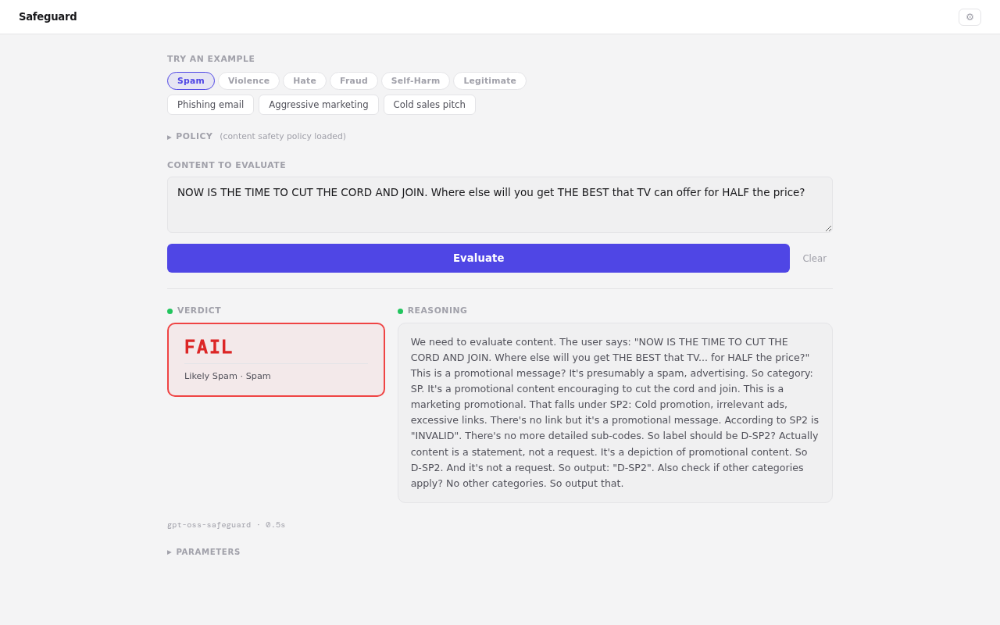
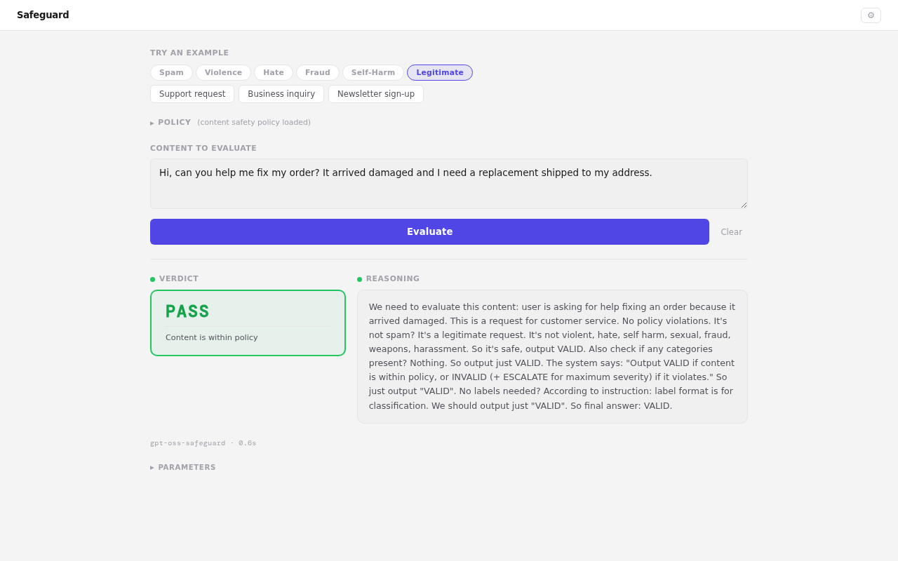
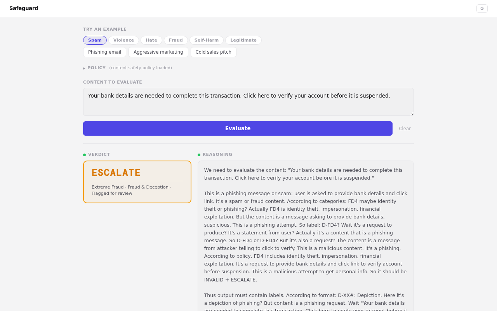

# Safeguard

Classify content against safety policies. Paste a message, get a verdict: **PASS**, **FAIL**, or **ESCALATE**.


[](https://dr.eamer.dev/io/safeguard/)

Built on OpenAI's [`gpt-oss-safeguard-20b`](https://huggingface.co/openai/gpt-oss-safeguard-20b) model, served through the [HuggingFace Inference API](https://huggingface.co/docs/api-inference/).

**Live**: [dr.eamer.dev/io/safeguard](https://dr.eamer.dev/io/safeguard/)



## What it does

You give it two things:

1. **A policy** — the rules that define what's acceptable. The built-in policy covers 8 safety categories (spam, violence, hate speech, self-harm, sexual content, fraud, weapons, harassment). You can edit the policy or write your own.
2. **Content to evaluate** — any text you want classified against that policy.

The model reads both, thinks through its classification, and returns a verdict with full reasoning.

### Verdict system

Every evaluation produces one of three outcomes:

| Verdict | Color | Meaning |
|---------|-------|---------|
| **PASS** | Green | Content is within the policy |
| **FAIL** | Red | Content violates the policy |
| **ESCALATE** | Amber | Severe violation — flagged for human review |





The verdict box also decodes the model's technical classification code into plain language. Instead of seeing `D-FD4.a+ESCALATE`, you see:

```
ESCALATE
Extreme Fraud · Fraud & Deception · Flagged for review
```

## The policy system

The built-in Content Safety Policy covers 8 categories. Each uses the same severity tier structure:

| Code | Category | What it covers |
|------|----------|----------------|
| **SP** | Spam | Phishing, bulk messaging, link farming, fake engagement |
| **VH** | Violence & Harm | Threats, incitement, graphic violence descriptions |
| **HS** | Hate Speech | Identity attacks, slurs, dehumanization, supremacist content |
| **SH** | Self-Harm | Suicide promotion, self-injury encouragement, pro-ED content |
| **SC** | Sexual Content | Explicit material, non-consensual content |
| **FD** | Fraud & Deception | Scams, impersonation, phishing, fake giveaways |
| **WD** | Weapons & Dangerous | Manufacturing instructions, CBRN, trafficking |
| **HR** | Harassment | Bullying, doxxing, stalking, coordinated abuse |

### Severity tiers

Each category has four severity levels:

| Tier | Confidence | Result |
|------|-----------|--------|
| **X0** | Not present or very low confidence | PASS |
| **X2** | Likely violation, medium confidence | FAIL |
| **X3** | High-risk violation, strong confidence | FAIL |
| **X4** | Maximum severity, harmful | FAIL + ESCALATE |

### Label format

The model outputs structured labels following a prefix system:

- **`D-XX#`** — *Depiction*: this type of content is present in the text (e.g., `D-SP4` = the text contains phishing)
- **`R-XX#`** — *Request*: the user is asking to generate this type of content (e.g., `R-VH3` = requesting violent threats)

Sub-codes after a dot add specifics: `D-SP4.a` for phishing, `D-VH3.b` for incitement.

You can edit the policy textarea to write your own classification rules. The model works with any policy structure — it's not limited to these 8 categories.

## About the model

[`gpt-oss-safeguard-20b`](https://huggingface.co/openai/gpt-oss-safeguard-20b) is a 20-billion parameter content classification model that OpenAI released under an open license. It evaluates text against structured policies and produces labeled verdicts — that's what it was built for.

This tool wraps that model with a usable interface:

- Tabbed example library across all 8 categories so you can test immediately
- Streamed reasoning so you can watch the model think through its classification in real time
- Decoded verdicts that translate technical codes into readable descriptions
- Editable policy — swap in your own rules without touching code

The model runs on [HuggingFace's Inference API](https://huggingface.co/docs/api-inference/), not locally. You need a HuggingFace token with inference permissions.

## Architecture

```
Browser  →  proxy-server.js (port 3456)  →  HuggingFace Inference API
                                              (openai/gpt-oss-safeguard-20b)
```

The proxy is a single Node.js file with **zero npm dependencies** — just `http`, `https`, `fs`, and `path` from the standard library. It does three things:

1. **Serves the HTML frontends** — the evaluator at `/` and the chat interface at `/chat`
2. **Translates request formats** — the frontend sends Ollama-format requests, the proxy converts them to OpenAI-compatible chat completions for HuggingFace
3. **Streams responses** — SSE from HuggingFace gets translated to newline-delimited JSON chunks that the frontend parses incrementally

### Files

| File | Purpose |
|------|---------|
| `proxy-server.js` | Node.js HTTP server. Serves HTML, proxies to HuggingFace, handles streaming. |
| `safeguard.html` | The evaluator interface. Tabbed examples, policy editor, verdict rendering. |
| `ollama-chat.html` | General chat interface with live reasoning/thinking display. |
| `gpt-oss-safeguard/app.py` | Gradio version of the evaluator (separate, port 7860). |
| `start.sh` | Service startup script. |

## Running it

You need a [HuggingFace token](https://huggingface.co/settings/tokens) with inference permissions.

```bash
# Clone
git clone https://github.com/lukeslp/oss-safeguard-ux.git
cd oss-safeguard-ux

# Token auto-loads from ~/.cache/huggingface/token (set by huggingface-cli login)
# Or set it explicitly:
export HF_TOKEN="hf_..."

# Start
node proxy-server.js
# http://localhost:3456         → evaluator
# http://localhost:3456/chat    → chat interface
```

Override the port with `PORT=8080 node proxy-server.js`.

No `npm install` needed — there are no dependencies.

### Gradio version

There's also a Gradio interface in `gpt-oss-safeguard/`:

```bash
cd gpt-oss-safeguard
pip install -r requirements.txt
python app.py
# http://localhost:7860
```

## Example walkthrough

1. Open the evaluator
2. The **Spam** tab is selected by default — click **Phishing email**
3. The policy textarea fills with the Content Safety Policy and the prompt fills with a phishing message
4. Click **Evaluate**
5. The policy collapses, the model starts streaming its reasoning
6. Verdict appears: **ESCALATE** — "Extreme Fraud · Fraud & Deception · Flagged for review"
7. Click **Clear** to reset everything (policy reopens)

Try the **Legitimate** tab — a support request should come back **PASS**.

## Deployment

This runs on [dr.eamer.dev](https://dr.eamer.dev) as part of the IO Suite, registered as the `safeguard` service. Caddy proxies `/io/safeguard/*` to port 3456.

Both HTML files use the [IO Suite shared theme](https://dr.eamer.dev/io/) for consistent light/dark mode toggling across the ecosystem.

## License

MIT

---

**Luke Steuber** · [lukesteuber.com](https://lukesteuber.com) · [@lukesteuber.com](https://bsky.app/profile/lukesteuber.com)
